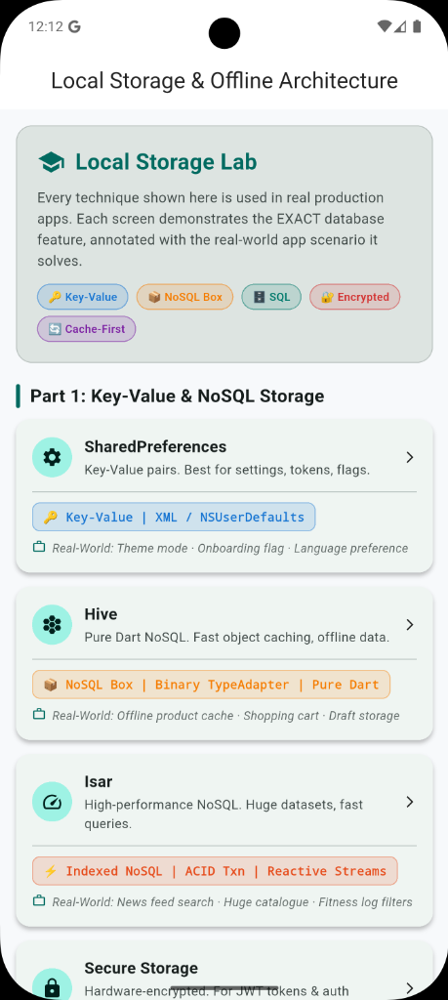
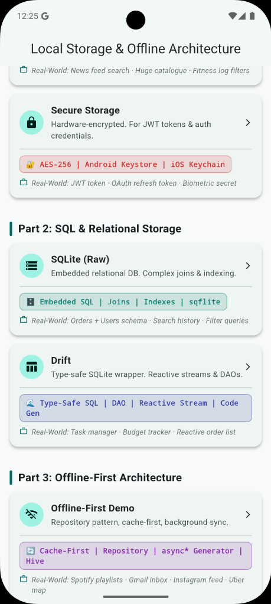
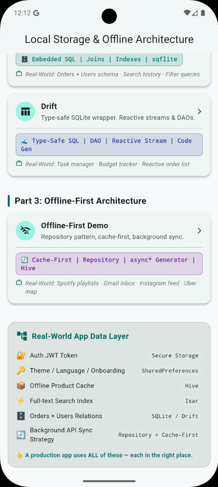

# Flutter Local Storage & Offline Architecture Playground

Welcome to the **Flutter Local Storage & Offline Architecture Playground**! This project is a comprehensive, production-ready educational workspace designed to teach developers the persistence options, structures, and offline-first design patterns available in the Flutter ecosystem.

Instead of generic minimum viable examples, this project implements **fully-functional interactive labs (TryLabs)**, step-by-step developer guide consoles, and production-grade error handling simulations for each database.

<p align="center">
  
  &nbsp;&nbsp;&nbsp;&nbsp;
  
  &nbsp;&nbsp;&nbsp;&nbsp;
  
</p>

---

## 🗺️ Learning Path & Curriculum

The playground is structured into **seven database engines**, ordered from basic key-value caches to advanced multi-isolate relational engines and offline-first repositories.

| Module | Storage Type | Core Learning Objectives | Directory & Documentation |
| :--- | :--- | :--- | :--- |
| **1. Shared Preferences** | Key-Value | Legacy API, Async API, caching wrappers, wiping keys. | [shared_preferences/](file:///Users/arpit/StudioProjects/FlutterLocalStorage/lib/features/shared_preferences/README.md) |
| **2. Hive** | NoSQL Document | Box architectures, type adapters, memory-cached fast NoSQL. | [hive/](file:///Users/arpit/StudioProjects/FlutterLocalStorage/lib/features/hive/README.md) |
| **3. Isar** | NoSQL Document | Complex queries, multi-isolate concurrency, `@embedded` links. | [isar/](file:///Users/arpit/StudioProjects/FlutterLocalStorage/lib/features/isar/README.md) |
| **4. Secure Storage** | Key-Value (Encrypted) | OS-level Keychain/KeyStore bindings, PlatformException recovery. | [secure_storage/](file:///Users/arpit/StudioProjects/FlutterLocalStorage/lib/features/secure_storage/README.md) |
| **5. SQLite (sqflite)** | Relational (SQL) | Raw SQL operations, `PRAGMA foreign_keys = ON`, Cascade Deletes. | [sqlite/](file:///Users/arpit/StudioProjects/FlutterLocalStorage/lib/features/sqlite/README.md) |
| **6. Drift** | Relational (Type-safe) | Query builders, reactive Streams, SQLite transaction rollbacks. | [drift/](file:///Users/arpit/StudioProjects/FlutterLocalStorage/lib/features/drift/README.md) |
| **7. Offline Cache** | Architecture Pattern | Cache-First stream generator, persistent Outbox sync queue. | [offline_cache/](file:///Users/arpit/StudioProjects/FlutterLocalStorage/lib/features/offline_cache/README.md) |

---

## ⚖️ Database Selection Guide & Comparison

Choosing the right local storage solution is critical for app performance and scalability. Use this guide to determine which database fits your scenario.

### When to use which database?

- **Shared Preferences**: Use for simple app configurations, theme settings, onboarding flags, and user preferences. Do not use for large datasets or sensitive information.
- **Secure Storage**: Use exclusively for sensitive data like JWT tokens, API keys, passwords, and encryption seeds. It uses platform-native hardware encryption.
- **Hive**: Use for fast, offline caching of API responses (JSON), draft objects, and user data where complex relational queries aren't needed. Great for high-speed read/write.
- **Isar**: Use for complex, large-scale NoSQL data where you need fast full-text search, rich indexes, and reactive UI streams (`watch()`), without the boilerplate of SQL. Extremely fast performance.
- **SQLite (sqflite)**: Use when your data is highly relational, requires complex `JOIN`s, or you have existing SQL knowledge and want raw control over the database engine.
- **Drift**: Use when you need the power of SQLite but want compile-time type safety, a clean DAO pattern, and reactive UI streams built-in.
- **Offline Cache Pattern**: Use when building "Offline-First" apps (like Spotify or Gmail) where the UI instantly loads from a local cache while syncing with a remote API in the background.

### Comparison Table

| Feature | SharedPrefs | Secure Storage | Hive | Isar | sqflite | Drift |
| :--- | :--- | :--- | :--- | :--- | :--- | :--- |
| **Data Model** | Key-Value | Key-Value | Document / NoSQL | Document / NoSQL | Relational SQL | Relational SQL |
| **Schema** | None | None | Optional | Dart Class | SQL DDL | Dart Class |
| **Complex Queries**| ❌ No | ❌ No | ❌ No | ✅ Fluent API | ✅ Raw SQL | ✅ Type-Safe SQL |
| **Reactive Streams**| ❌ No | ❌ No | ⚠️ ValueListenable| ✅ `.watch()` | ❌ No | ✅ `.watch()` |
| **Encryption** | ❌ No | ✅ OS Hardware | ✅ AES-256 | ❌ No | ⚠️ SQLCipher | ⚠️ SQLCipher |
| **Performance** | Medium | Slow | Very Fast | Extremely Fast | Medium | Fast |
| **Setup Complexity**| 🟢 Zero | 🟢 Low | 🟢 Low | 🔴 High | 🟡 Medium | 🔴 High |

---

## 🏗️ Directory Architecture

The repository adheres to the **Feature-First Clean MVVM (Model-View-ViewModel)** architectural pattern. Each database type is completely isolated in its own folder under `lib/features/`:

```
lib/
  ├── features/
  │     ├── shared_preferences/       # Key-value persistence
  │     ├── hive/                     # Fast NoSQL box storage
  │     ├── isar/                     # High-performance NoSQL database
  │     ├── secure_storage/           # Cryptographically encrypted credentials
  │     ├── sqlite/                   # Relational database with raw SQL
  │     ├── drift/                    # Type-safe, reactive SQLite query builder
  │     └── offline_cache/            # Repository pattern offline outbox sync
  │
  ├── presentation/                   # Shared UI structures
  │     ├── navigation/               # Clean route coordinator
  │     └── widgets/                  # Reusable components (extension widgets)
  │
  └── main.dart                       # Global MultiProvider registry and entry
```

Inside each feature folder, files are organized by responsibility:
- **`*_service.dart` or `*_database.dart`**: Data access object (DAO) or service layer executing raw database operations.
- **`*_viewmodel.dart`**: MVVM State Holder managing loading indicators, database states, and console logs.
- **`*_screen.dart`**: Interactive markdown-style guide showing syntax examples and core concepts.
- **`*_example.dart`**: The **TryLab screen** containing form inputs, action buttons, and a live terminal event console log.
- **`README.md`**: Dedicated documentation explaining concepts, performance metrics, and syntax.

---

## 🚀 Getting Started

### Prerequisites
Make sure your development machine has Flutter installed.
- Flutter SDK `>=3.3.0`
- Cocoapods (for iOS Keychain integrations)

### Installation
1. Clone this repository to your workspace.
2. Run package retrieval:
   ```bash
   flutter pub get
   ```
3. Run Isar/Hive code generators:
   ```bash
   dart run build_runner build --delete-conflicting-outputs
   ```
4. Run the application:
   ```bash
   flutter run
   ```

---
