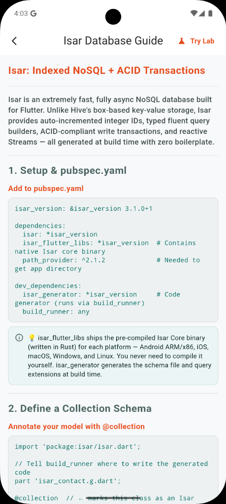
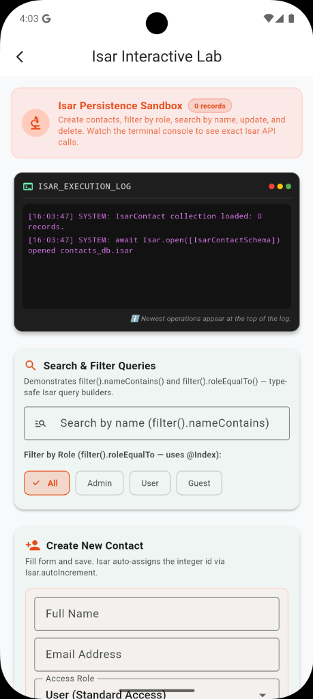

# Isar NoSQL Database

Isar is an extremely fast, fully async NoSQL database built for Flutter. Unlike Hive's box-based key-value storage, Isar provides auto-incremented integer IDs, typed fluent query builders, ACID-compliant write transactions, and reactive Streams — all generated at build time with zero boilerplate.

<p align="center">
  

  
  &nbsp;&nbsp;&nbsp;&nbsp;
</p>

---

## 1. Setup & pubspec.yaml

Add to `pubspec.yaml`:
```yaml
isar_version: &isar_version 3.1.0+1

dependencies:
  isar: *isar_version
  isar_flutter_libs: *isar_version  # Native Isar core binary
  path_provider: ^2.1.2             # To get app directory

dev_dependencies:
  isar_generator: *isar_version     # Code generator
  build_runner: any
```

> **💡 Note:** `isar_flutter_libs` ships the pre-compiled Isar Core binary (written in Rust) for each platform. You never need to compile it yourself. `isar_generator` generates the schema file and query extensions at build time.

---

## 2. Define a Collection Schema

Annotate your model with `@collection`:

```dart
import 'package:isar/isar.dart';

part 'isar_contact.g.dart';

@collection
class IsarContact {
  Id id = Isar.autoIncrement;

  @Index(type: IndexType.value)
  String name = '';

  String email = '';

  @Index(type: IndexType.value)
  String role = 'User';

  DateTime createdAt = DateTime.now();
}
```

Run code generation:
```bash
flutter pub run build_runner build --delete-conflicting-outputs
```

---

## 3. Initialization

Call once at app startup:
```dart
import 'package:path_provider/path_provider.dart';

Future<void> initIsar() async {
  WidgetsFlutterBinding.ensureInitialized();
  final dir = await getApplicationDocumentsDirectory();

  final isar = await Isar.open(
    [IsarContactSchema],
    directory: dir.path,
    name: 'contacts_db',
  );
}
```

---

## 4. CRUD Operations

### CREATE — Insert inside writeTxn()
```dart
final contact = IsarContact()..name = 'Alice Chen'..email = 'alice@example.com';

final assignedId = await isar.writeTxn(() async {
  return await isar.isarContacts.put(contact);
});
```

### READ — Typed Query Builders
```dart
// ALL records
final all = await isar.isarContacts.where().sortByName().findAll();

// SINGLE record by ID
final alice = await isar.isarContacts.get(1);

// Filter
final admins = await isar.isarContacts.filter().roleEqualTo('Admin').findAll();
```

### UPDATE
```dart
final contact = await isar.isarContacts.get(1);
if (contact != null) {
  contact.name = 'Alice Smith';
  await isar.writeTxn(() async {
    await isar.isarContacts.put(contact); // Treats as update since id exists
  });
}
```

### DELETE
```dart
await isar.writeTxn(() async {
  final deleted = await isar.isarContacts.delete(1);
});
```

> **🔐 ACID Transactions:** Atomic (all or nothing), Consistent (never half-written), Isolated (concurrent reads don't see partial writes), Durability (flushed to OS file system).

---

## 5. Reactive Streams (Watchers)

Watch a query for real-time UI updates:
```dart
final query = isar.isarContacts.where().sortByName().build();
final stream = query.watch(fireImmediately: true);

// Use with StreamBuilder
StreamBuilder<List<IsarContact>>(
  stream: stream,
  builder: (context, snapshot) {
    // UI automatically rebuilds on DB changes
  }
)
```

> **⚡ Isar Watchers vs Hive:** Isar's `watch()` is a true reactive stream backed by DB change events. It fires AFTER `writeTxn` commits — never mid-write. Works across isolates.

---

## 6. Advanced Queries & Indexes

### Multi-condition Queries
```dart
final results = await isar.isarContacts
  .filter()
  .roleEqualTo('Admin')
  .and()
  .nameStartsWith('A')
  .findAll();
```

### Index Types
- `IndexType.value`: Enables sortBy, greaterThan, lessThan, between.
- `IndexType.hash`: Only equality; 50% smaller on disk.
- `IndexType.hashElements`: Searching inside `List<String>` fields.
- `@Index(unique: true)`: Rejects duplicates.

---

## 7. Isar Inspector (Debug Tool)

The Isar Inspector launches automatically in debug mode. Connect at `http://localhost:8080`.
Features: Browse collections, run filter queries, edit/delete records interactively.

---

## 8. Embedded Objects (Nested Models)

Define nested complex models without separate tables using `@embedded`.

```dart
@collection
class IsarContact {
  Id id = Isar.autoIncrement;
  String name = '';
  IsarAddress? address; // Nested object
}

@embedded
class IsarAddress {
  String? street;
  String? city;
  String? zipCode;

  // RULE: Embedded classes must have a default constructor with no required parameters!
  IsarAddress({this.street, this.city, this.zipCode});
}
```

> **💡 Embedded Object Rules:**
> - **No Primary Key:** Embedded classes must NOT have an Id field.
> - **Inlined Storage:** Stored directly inside the parent collection record. No separate table.
> - **Nested Lists:** Can define lists of embedded objects natively (e.g. `List<IsarAddress>`).

---

## 9. Error Handling & Concurrency

### Handling Transaction Rollbacks
If any error is thrown inside `writeTxn`, the entire transaction rolls back automatically.
```dart
try {
  await isar.writeTxn(() async {
    await isar.isarContacts.put(contact);
    throw Exception("Crash mid-transaction");
  });
} catch (e) {
  print("Transaction failed. All changes rolled back!");
}
```

### Concurrency Model
- **Single Writer, Multi-Reader:** Only one `writeTxn` can execute at a time. Other writes wait in a queue. Reads are fully non-blocking and can run concurrently while writes execute.
- **Background Threading:** Isar runs core DB ops in a separate native thread (C++ core).
- **Database Locked States:** Opening the same database from two separate processes throws `DatabaseAlreadyOpenedException`.

---

## 10. Database Comparison

| Feature | Isar | Hive | SQLite |
| :--- | :--- | :--- | :--- |
| **Data model** | NoSQL ORM | Key-Value | Relational SQL |
| **Schema required** | Dart class ⚠️ | Optional ✅ | SQL DDL ⚠️ |
| **Auto ID** | Auto-increment ✅ | Manual key ❌ | AUTOINCREMENT ✅ |
| **ACID support** | Full (writeTxn) ✅ | None ❌ | Full (BEGIN/COMMIT) ✅ |
| **Queries** | Fluent Type-safe ✅ | Key/Map only ❌ | SQL queries ✅ |
| **Indexes** | Rich B-Tree ✅ | None ❌ | Custom SQL indexes ✅ |
| **Reactive** | `watch()` Streams ✅ | `ValueListenable` ⚠️ | No ❌ |
| **Threading** | Background Isolate ✅ | Main thread blocks ⚠️ | SQLite thread pool ✅ |
| **Best for** | Fast complex NoSQL | Offline cache/configs | Relational data |
