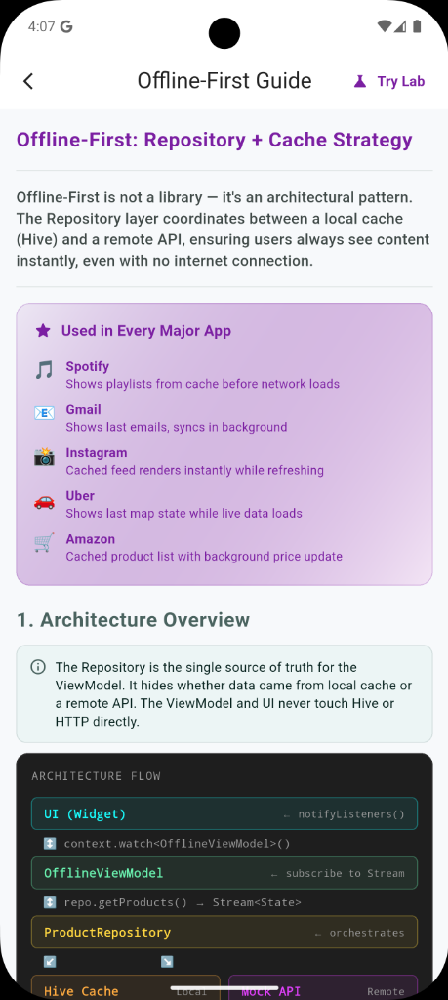
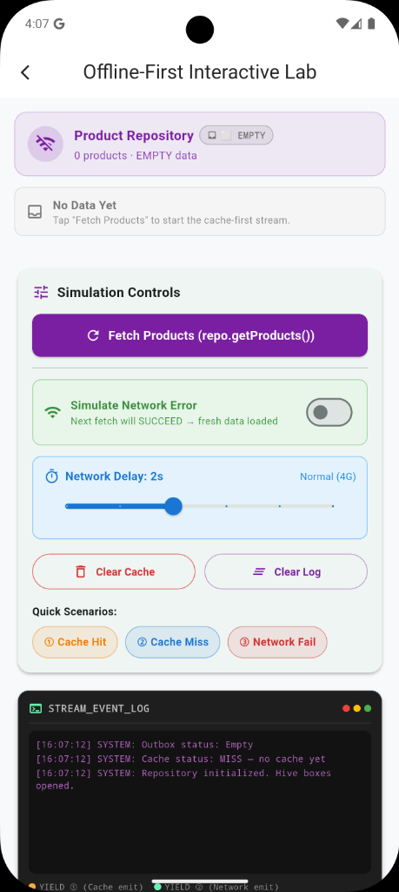

# Offline-First: Repository + Cache Strategy

Offline-First is not a library — it's an architectural pattern. The Repository layer coordinates between a local cache (e.g., Hive) and a remote API, ensuring users always see content instantly, even with no internet connection. This pattern is used by Spotify, Gmail, Instagram, Uber, and more.

<p align="center">
  

  
  &nbsp;&nbsp;&nbsp;&nbsp;
</p>

---

## 1. Architecture Overview

The Repository is the single source of truth for the ViewModel. It hides whether data came from the local cache or a remote API. The ViewModel and UI never touch the local database or HTTP directly.

```
UI (Widget) ↔ OfflineViewModel ↔ ProductRepository ↔ Hive Cache (Local)
                                                   ↔ Mock API (Remote)
```

---

## 2. Setup & pubspec.yaml

Add to `pubspec.yaml`:
```yaml
dependencies:
  hive: ^2.2.3         # Local cache
  hive_flutter: ^1.1.0 # Flutter init helper
  path_provider: ^2.1.2 # Find device DB path
```

Initialize Hive in `main.dart`:
```dart
void main() async {
  WidgetsFlutterBinding.ensureInitialized();
  await Hive.initFlutter(); // sets up file path
  runApp(const MyApp());
}
```

---

## 3. The Repository Pattern

A Repository abstracts data access. It is the ONLY place in your codebase that knows about both the local cache and the remote API.

```dart
class ProductRepository {
  static const _boxName = 'product_cache';
  late Box _box;

  Future<void> initialize() async {
    _box = await Hive.openBox(_boxName);
  }

  // The main offline-first stream
  Stream<RepositoryState> getProducts() async* { ... }
}
```

---

## 4. Hive as the Cache Layer

We store products as JSON Maps in a plain Hive Box — no TypeAdapter needed for this simple case.

```dart
Future<void> _writeCache(List<Product> products) async {
  await _box.put(
    'products',
    products.map((p) => p.toJson()).toList(),
  );
}

List<Product> _readCache() {
  final raw = _box.get('products');
  if (raw == null) return [];
  return (raw as List).map((item) => Product.fromJson(item)).toList();
}
```

---

## 5. async* Generator — The Core Mechanism

The `async*` keyword creates an asynchronous generator function. It returns a STREAM of values over time. This lets us emit cache first, then network.

```dart
Stream<RepositoryState> getProducts() async* {
  // ① Read cache synchronously and yield IMMEDIATELY
  final cached = _readCache();
  yield RepositoryState(products: cached, networkStatus: loading);

  // ② Fetch from API in background
  try {
    final fresh = await api.fetchProducts();
    await _writeCache(fresh); // update Hive

    // ② yield fresh network data
    yield RepositoryState(products: fresh, networkStatus: success);
  } catch (e) {
    // ② GRACEFUL DEGRADATION — show stale cache + error
    yield RepositoryState(products: cached, networkStatus: failure);
  }
}
```

---

## 6. ViewModel Subscribes to the Stream

```dart
class OfflineViewModel extends ChangeNotifier {
  RepositoryState _state = const RepositoryState();
  RepositoryState get state => _state;

  void fetchProducts() {
    _sub?.cancel();
    _sub = _repo.getProducts().listen((state) {
      _state = state;     // update on every yield
      notifyListeners();  // rebuild UI
    });
  }
}
```

---

## 7. UI — Reacting to RepositoryState

The UI uses `context.watch<OfflineViewModel>()` and reads state fields to render. The cache is shown immediately alongside a subtle "Syncing..." badge.

```dart
final state = vm.state;

if (state.isEmpty && state.isLoading) {
  return SkeletonList(); // First launch, no cache yet
}

return Column(children: [
  if (state.isLoading) SyncingBanner(),
  if (state.networkStatus == failure) OfflineBanner(),
  ProductList(products: state.products), // ALWAYS shown (cache or network)
]);
```

---

## 8. Graceful Degradation

Graceful degradation means failing gracefully by showing the best available data alongside a clear status message.
- **Cache Hit + Network OK:** Show fresh data. Cache updated.
- **Cache Hit + Network Fail:** Show stale cache + offline banner.
- **Cache Miss + Network OK:** Show skeleton → fresh data loads.
- **Cache Miss + Network Fail:** Show empty state + retry button.

---

## 9. Writing to Cache while Offline (Outbox Pattern)

Toggling favorites or writing data offline uses the Outbox Pattern:

1. **Optimistic UI Update:** Update the local cache (Hive) instantly so the user sees changes immediately.
2. **Outbox Queuing:** Save the operation details into a persistent pending box (`offline_sync_outbox`).
3. **Synchronization:** Trigger a background process to push changes to the server when network is restored.

```dart
Future<void> toggleFavoriteOffline(int productId) async {
  // 1. Optimistic write directly into product cache
  final cached = _readCache();
  // ... update cache and write ...

  // 2. Queue write event into pending sync box
  await _outboxBox.put(actionId, {
    'productId': productId,
    'action': 'toggle_favorite',
  });
}
```

---

## 10. Caching Strategy Comparison

| Strategy | Behavior | Ideal Use Case |
| :--- | :--- | :--- |
| **Cache-First (Speed)** | Yields local cache immediately, then fetches network in background to update cache. | Social feeds, product catalogs, profile screens where loading speed is critical. |
| **Network-First (Accuracy)** | Tries network first. Falls back to local cache only if network fails. | Financial transactions, shopping checkout, live balances where fresh data is mandatory. |
| **Cache-Only (Offline)** | Only reads from local DB. Never makes HTTP requests. | App configurations, static onboarding pages, localized translations. |

---

## 11. Production Tips

- **Cache Expiry:** Store `lastSyncTime`. Re-fetch automatically if cache is older than X minutes.
- **Cache Size Limit:** Store only the most recent N items. Use `box.values.take(100)` to cap memory.
- **Secure Caching:** Never cache sensitive data (JWT, PII) in Hive. Use `flutter_secure_storage`.
- **Background Sync:** Use `workmanager` to sync while app is closed.
- **Connectivity Check:** Use `connectivity_plus` to skip API calls when offline.
