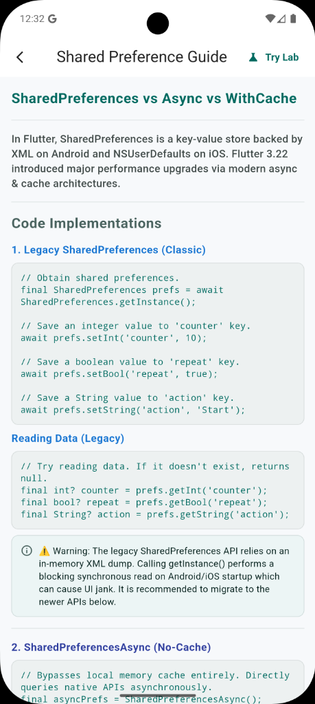
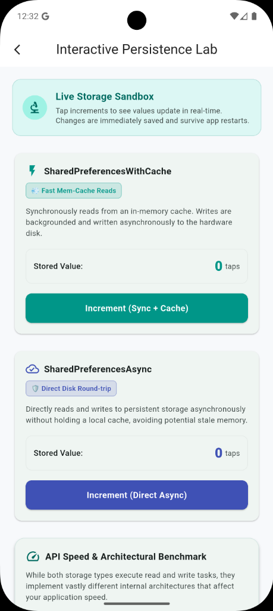

# SharedPreferences vs Async vs WithCache

In Flutter, SharedPreferences is a key-value store backed by XML on Android and NSUserDefaults on iOS. Flutter 3.22 introduced major performance upgrades via modern async & cache architectures.

<p align="center">
  
 &nbsp;&nbsp;&nbsp;&nbsp;
  
</p>

---

## 1. Setup & pubspec.yaml

Add to `pubspec.yaml`:
```yaml
dependencies:
  shared_preferences: ^2.5.5
```
That's it! No code generators, no `build_runner`, no native plugins to configure. Works out of the box on Android, iOS, macOS, Windows, Linux, and Web.

**Platform Notes (automatic):**
- Android → XML file at `/data/data/<pkg>/shared_prefs/`
- iOS / macOS → NSUserDefaults
- Windows → Registry or local app data file
- Web → localStorage
- Linux → XDG config directory

> **💡 Zero Setup:** Unlike Hive (needs `initFlutter()`), Isar (needs native binaries), or SQLite, SharedPreferences has ZERO setup overhead.

---

## 2. Legacy SharedPreferences (Classic)

```dart
final SharedPreferences prefs = await SharedPreferences.getInstance();

// Writes (asynchronous)
await prefs.setInt('counter', 10);
await prefs.setBool('repeat', true);

// Reads (synchronous after init)
final int? counter = prefs.getInt('counter');
```

> **⚠️ Warning:** The legacy API relies on an in-memory XML dump. Calling `getInstance()` performs a blocking synchronous read on startup which can cause UI jank. Recommend migrating to newer APIs below.

---

## 3. SharedPreferencesAsync (No-Cache)

Bypasses local memory cache entirely. Directly queries native APIs asynchronously.

```dart
final asyncPrefs = SharedPreferencesAsync();

// Writes asynchronously
await asyncPrefs.setBool('repeat', true);

// Reads asynchronously (always fetches fresh data from hardware disk)
final bool? repeat = await asyncPrefs.getBool('repeat');
```

> **💡 Best Use Case:** Ideal if you write to the preferences from background isolates, native Kotlin/Swift code, or another thread. It never goes stale.

---

## 4. SharedPreferencesWithCache (Super-Fast Cached)

Synchronous reads with asynchronous background writes.

```dart
final SharedPreferencesWithCache prefsWithCache = 
    await SharedPreferencesWithCache.create(
  cacheOptions: const SharedPreferencesWithCacheOptions(
    // allowList: Keys that aren't included cannot be used.
    allowList: <String>{'counter'},
  ),
);

// Writes asynchronously in the background.
await prefsWithCache.setInt('counter', 15);

// Reads synchronously and instantly from memory cache!
final int? counter = prefsWithCache.getInt('counter');
```

> **⚡ Best Use Case:** Ideal for the vast majority of app preferences (e.g., Theme, Flags) because reading is instant without causing UI lag. Keys outside the `allowList` are blocked to keep memory small.

---

## 5. Data Migration (Legacy to Async)

```dart
import 'package:shared_preferences/util/legacy_to_async_migration_util.dart';

final SharedPreferences prefs = await SharedPreferences.getInstance();

// Migrates legacy entries to SharedPreferencesAsync safely without data loss.
await migrateLegacySharedPreferencesToSharedPreferencesAsyncIfNecessary(
  legacySharedPreferencesInstance: prefs,
  sharedPreferencesAsyncOptions: const SharedPreferencesOptions(),
  migrationCompletedKey: 'migrationCompleted',
);
```

> **🚀 Note:** Run this migration utility once during app startup.

---

## 6. Delete & Clear APIs

### Legacy
```dart
await prefs.remove('counter');
await prefs.clear(); // ⚠️ nuclear option: deletes EVERY key
```

### Async
```dart
await asyncPrefs.remove('externalCounter');
await asyncPrefs.clear(allowList: <String>{'counter', 'theme'}); // Wipes specific keys
```

### WithCache
```dart
await prefsWithCache.remove('counter'); // Removes from cache and disk
await prefsWithCache.clear(); // Only clears keys in the allowList
```

> **⚡ Key Insight:** `SharedPreferencesWithCache` ONLY manages keys in its `allowList`. Calling `clear()` on one instance does NOT delete keys belonging to other instances.

---

## 7. Error Handling & Pitfalls

**Pitfall 1: Wrong Type**
If you store an `int` but read it as a `String`, it returns `null` (not a crash).

**Pitfall 2: Null return without a default**
Always provide a default value.
```dart
final int count = prefs.getInt('counter') ?? 0; // ✓ Safe
// final int count = prefs.getInt('counter')!;  // ❌ Crash risk!
```

**Pitfall 3: Storing LARGE data**
SharedPreferences is backed by XML/plist — NOT designed for large data. Keep each value < 1KB. For complex data → use Hive or SQLite.

---

## 8. API Comparison

### The Three SharedPreferences APIs

| Feature | Legacy | Async | WithCache |
| :--- | :--- | :--- | :--- |
| **Read type** | Sync ✅ | Async ⏳ | Sync ✅ |
| **Write type**| Async ⏳ | Async ⏳ | Async ⏳ |
| **Memory cache**| Yes (all) | None | Yes (scoped) |
| **Staleness risk**| High ⚠️ | None ✅ | Low ✅ |
| **Isolate safe**| No ❌ | Yes ✅ | No ❌ |
| **Key scoping**| None | None | allowList ✅ |
| **Best for** | Migration | Multi-process| UI prefs |

### SharedPreferences vs Other Databases

| Property | SharedPrefs | Hive | SQLite | Isar |
| :--- | :--- | :--- | :--- | :--- |
| **Data model** | Key-Value | Key-Value | Relational | NoSQL ORM |
| **Schema** | None | None/TypeAdap| SQL DDL | Dart class |
| **Complex queries**| No ❌ | No ❌ | Yes ✅ | Yes ✅ |
| **Encryption** | No ❌ | AES opt. ✅ | SQLCipher | No ❌ |
| **Setup complexity**| Zero 🟢 | Low 🟢 | Medium 🟡 | High 🔴 |
| **Best use case** | App flags | Offline cache | Relational | Large NoSQL |
